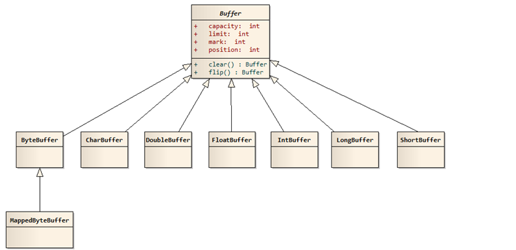

 # JavaNIO

---
## 一 、概述
  传统的输入流和输出流大多都是通过字节移动来处理，因此通常效率不高，JDK1.4开始，java 提供了一系列改进的新功能，这些功能，统称为新IO（New IO）,简称 NIO。新的IO 采用内存映射文件的方式来处理输入和输出，将文件或文件的一段区域映射到内存中，像访问内存一样来访问文件了。

##  二、基本包的介绍
- java.nio包： 主要是Buffer相关类
- java.nio.channels 包：主要包含与Channel和Selector相关的类
- java.nio.charset 包：主要包含与字符集相关的类
- java.nio.channels.spi 包 ： 主要 包含与Channel相关的服务提供编程接口
- java.nio.charset.spi 包： 主要包含与Channel 相关的服务提供变成接口

##  Buffer

- Buffer是一个**抽象类**，最常用的子类ByteBuffer，结构上看Buffer就像一个数组一样，可以保存多个类型相同的数据。对应的基本类型除了boolean外都有相应的Buffer类：**CharBuffer、ShortBuffer、IntBuffer、LongBuffer、FloatBuffer、DoubleBuffer**。
- 其中ByteBuffer类还有一个子类**MapperdByteBuffer**,用于表示Channel将磁盘文件部分或全部内容映射到内存中后得到的结构，可以由Channel的map方法返回。
- 这些Buffer类通常都通过  public static IntBuffer allocate(int capacity) 获得Buffer对象。

### Buffer三个概念
- 容量 capacity: 缓存区的容量，表示Buffer的最大数据容量，创建后不能改变
- 界限 limit ：第一个不应该被读取或者写入的缓冲区位置索引。即位于limit后的数据不可读也不可写
- 位置 position ： 用于指明下一个可以被读出或者写入的缓冲区位置索引（和IO中的指针类似），刚新建的position为0，从Channel中读取1个数据后position为1
-此外Buffer中还有mark，允许直接将position直接定位到mark。

buffer的clear和flip部分源码实例

```java
    /**
    *clear不是清空Buffer数据，而是将position置位0，limit设为容量最大值
    *为装入数据做准备
    */
    public final Buffer clear() {
        position = 0;
        limit = capacity;
        mark = -1;
        return this;
    }


    /**
    * limit设为position的位置，position移到0，
    * 为输出数据做准备
    */
    public final Buffer flip() {
        limit = position;
        position = 0;
        mark = -1;
        return this;
    }

```
buffer的所有子类提供put() 和 get() 方法，用于向Buffer中放入数据和取出数据。
```java
    // 简单的实例代码
    public static void main(String[] args) {
        CharBuffer buff = CharBuffer.allocate(8);
        System.out.println("limit:" + buff.limit());
        System.out.println("position:" + buff.position());
        buff.put('a');
        buff.put('b');
        //放入两个元素后position 为2
        System.out.println("放入两个元素后position:" + buff.position());
        //放入两个元素后limit:8
        System.out.println("放入两个元素后limit:" + buff.limit());
        buff.flip();
        //flip后position:0
        System.out.println("flip后position:" + buff.position());
        //flip后limit:2
        System.out.println("flip后limit:" + buff.limit());
        // 覆盖到0的位置上的a
        buff.put('c');
        //仍然能够读取到缓冲区的内容  b
        System.out.println(buff.get(0));
        System.out.println("get后position:" + buff.position());
        buff.clear();
        //clear后position:0
        System.out.println("clear后position:" + buff.position());
        //clear后limit:8
        System.out.println("clear后limit:" + buff.limit());
    }
```
- ByteBuffer 还提供了一个allocateDirect()方法直接创建Buffer，创建成本比allocate高，但直接Buffer的读取效率更高（生存期长的Buffer可以考虑）

## Channel

Channel 类似传统的流对象，但也有些不同
- Channel 直接将指定的文件部分或全部映射为Buffer
- 程序不能直接访问Channel，Channel只能与Buffer进行交互。即程序不管是写还是读，都需要通过Buffer 去与Channel交互

基本概念
- Channel是个**接口**，提供 **DatagramChannel、FileChannel、Pipe.SinkChannel、SelectableChannel、ServerSocketChannel**。
- Channel不应该通过构造器，而是通过传统的InputStream、OutputStream的getChannel方法或得，各个流获取对应的Channel()
- 最常用的三类方法map()、read()、write() 
- map方法签名：(FileChannel.MapMode mode,long position,long size)  ,第一个参数执行映射模式，分为只读，读写等模式，第二和第三用于控制哪些数据映射为ByteBuffer。

几个类
- Pipe.SinkChannel 和 Pipe.SourceChannel 支持线程之间的通信
- ServerSocketChannel 和 SocketChannel  支持TCP网络通信
- DatagramChannel 支持UDP网络通信

下面为文本复制简单实现
```java
    static void test01(){
        String path = "C://Users//zhangxian//Desktop//test.txt";
        File f = new File(path);
        try(
            FileChannel inChannel = new  FileInputStream(f).getChannel();
            FileChannel outChannel = 
                 new FileOutputStream("C://Users//zhangxian//Desktop//copy.txt").getChannel();
        ){
            //fileChannel 全部数据映射为ByteBuffer
            MappedByteBuffer buffer = inChannel.map(FileChannel.MapMode.READ_ONLY,  0, f.length());
            Charset charset = Charset.forName("GBK");
            outChannel.write(buffer);
            // clear一下，方便下面打印
            buffer.clear();
            // CharsetDecoder 用于将ByteBuffer转换成CharBuffer
            CharsetDecoder decoder = charset.newDecoder();
            CharBuffer charBuffer = decoder.decode(buffer);
            System.out.println(charBuffer.toString());
        } catch (IOException e) {
            e.printStackTrace();
        }
    }
```
上面的 inChannel.map(FileChannel.MapMode.READ_ONLY,  0, f.length()); 将数据一次全部拿出，下面方法分几次拿
```java
     static void test02() throws Exception{
        try(
            FileInputStream fis = new FileInputStream ("C://Users//zhangxian//Desktop//test.txt");
            FileChannel channel = fis.getChannel();
        ){
            ByteBuffer buff = ByteBuffer.allocate(256);
            int index = 0;
            while(  channel.read(buff) != -1  ){
                buff.flip();
                Charset charset = Charset.forName("GBK");
                CharsetDecoder decoder = charset.newDecoder();
                CharBuffer cbuff = decoder.decode(buff);
                System.out.println(cbuff);
                buff.clear();
                index ++;
            }
            System.out.println(index);
        }
    }
```
### 字符集Charset （上面方法用到 CharsetDecoder，简单说下Charset）

- Charset 抽象类实现 Comparable<Charset>
- availbleCharsets() 静态方法来获取当前JDK所支持的所有字符集
- Charset的forName() 方法来创建赌赢的Charset对象
- CharBuffer decode(ByteBuffer byteB) 将ByteBuffer  中的字节序列 转换成字符序列
- ByteBuffer encode（CharBuffer b） 将CharBuffer  中的字符序列 转换成字节序列
-ByteBuffer encode（String str）将String中的字符序列 转换成字节序列

### 文件锁（简单了解了下）

- FileChannel 中提供 lock() 和tryLock() 方法 来获取文件锁FileLock对象
- lock() 阻塞式的，如果不能获得文件锁，程序会阻塞
- tryLock 是非阻塞的，没能获取文件锁时返回null
- lock/ tryLock (long position,long size,boolean shared) 对文件的部分加锁
- FileChannel 获取到的锁类型为 FileLock ， FileLock 的 release() 释放锁

## Files 和 Paths

-  java7在java.nio.file 下 新增Path接口，Paths工具类，Files工具类。 这些接口和工具类对NIO中的功能进行了高度封装，大大简化了文件系统的IO编程。

### Path接口

- 在java.io及java.nio中，是通过File类来访问文件系统（文件和目录都用File类表示），但是File类不能利用特定文件系统的特性，且性能不高，抛出的异常也太抽象，因此在NIO.2中引入了Path接口。Path接口表示的是一个与平台无关的路径（文件和目录都用Path表示）。

### Paths 工具类

- static Path get(URI uri) 直接通过路径返回Path对象
- static Path get(String first, String...more)通过给出的String字符串组装成一个Path对象

```java
            Path absolutePath = path.toAbsolutePath();
            System.out.println("path的绝对路径：");
            System.out.println(absolutePath);
            System.out.println("absolutePath的根路径： "+absolutePath.getRoot());
            System.out.println("absolutePath里包含的路径数量：" + absolutePath.getNameCount());

```

###Files 工具类  (感觉 Files 大部分方法都能在commons.io中找到相同作用的)
*   **操作文件**
copy(...) 拷贝文件，有3个重载方法，通常需要跟Path结合使用
createDirectory(...) 创建目录
createFile(...) 创建文件
delete(Path path) 删除文件

*   **读写文件**
lines(Path path) 使用默认编码读文件所有行进数组
readAlllines(path ,cs ) 使用指定编码读所有行到数组
write(...) 写文件，可以批量将数组中的数据写入文件，也可以指定编码
walkFileTree() 遍历路径

判断属性
isHidden(Path path) 是否隐藏
isReadable(Path path) 是否可读
isDirectory(...) 是否是文件夹
