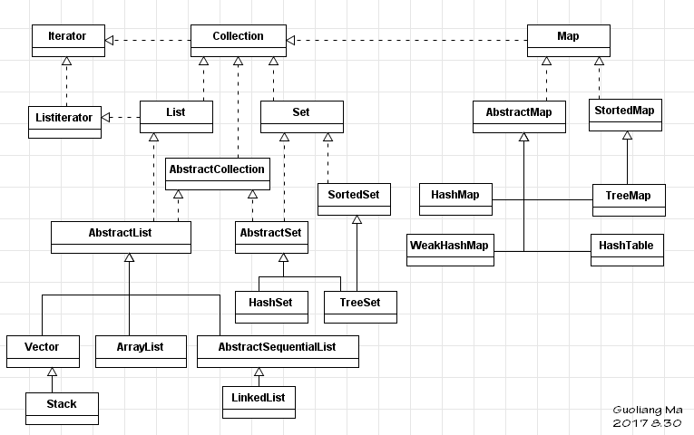

# Java集合

## 前言

### Java集合概述

集合类存放于`java.util`包中。集合类存放的都是对象的引用，而非对象本身，出于表达上的便利，我们称集合中的对象就是指集合中对象的引用（reference)。
集合类型主要有3种：`set`(集）、`list`(列表）和`map`(映射)。

## 集合框架模型

- 继承关系
- set
- list
- map

## 继承关系

Java API中所有的集合类，都实现了`Collection`接口，他的一个类继承结构如下：  

  

- Collection  <--  List  <--  Vector
- Collection  <--  List  <--  ArrayList
- Collection  <--  List  <--  LinkedList
- Collection  <--  Set  <--  HashSet
- Collection  <--  Set  <--  HashSet  <--  LinkedHashSet
- Collection  <--  Set  <--  SortedSet  <--  TreeSet
- Collection  <--  Map <--  AbstractMap  <--  HashMap
- Collection  <--  Map <--  SortedMap  <--  TreeMap

## Set（集）

集（set）是最简单的一种集合，它的对象不按特定方式排序，只是简单的把对象加入集合中，就像往口袋里放东西。对集中成员的访问和操作是通过集中对象的引用进行的，所以集中不能有重复对象。

集也有多种变体，可以实现排序等功能，如TreeSet，它把对象添加到集中的操作将变为按照某种比较规则将其插入到有序的对象序列中。它实现的是SortedSet接口，也就是加入了对象比较的方法。通过对集中的对象迭代，我们可以得到一个升序的对象集合。

HashSet： 使用HashMap的一个集的实现。虽然集定义成无序，但必须存在某种方法能相当高效地找到一个对象。使用一个HashMap对象实现集的存储和检索操作是在固定时间内实现的。

TreeSet： 在集中以升序对对象排序的集的实现。这意味着从一个TreeSet对象获得第一个迭代器将按升序提供对象。TreeSet类使用 了一个TreeMap。

## list（列表）

列表的主要特征是其对象以线性方式存储，没有特定顺序，只有一个开头和一个结尾，当然，它与根本没有顺序的集是不同的。列表在数据结构中分别表现为：数组和向量、链表、堆栈、队列。

Vector： 实现一个类似数组一样的表，自动增加容量来容纳你所需的元素。使用下标存储和检索对象就象在一个标准的数组中一样 。你也可以用一个迭代器从一个Vector中检索对象。Vector是唯一的同步容器类，当两个或多个线程同时访问时也是性能良好的。

Stack： 这个类从Vector派生而来，并且增加了方法实现栈，一种后进先出的存储结构。

LinkedList： 实现一个链表。由这个类定义的链表也可以像栈或队列一样被使用。

ArrayList： 实现一个数组，它的规模可变并且能像链表一样被访问。它提供的功能类似Vector类但不同步。

## Map（映射）

映射与集或列表有明显区别，映射中每个项都是成对的。映射中存储的每个对象都有一个相关的关键字（Key）对象，关键字决定了 对象在映射中的存储位置，检索对象时必须提供相应的关键字，就像在字典中查单词一样。关键字应该是唯一的。关键字本身并不能决定对象的存储位置，它需要对过一种散列(hashing)技术来处理，产生一个被称作散列码(hash code)的整数值，散列码通常用作一个偏置量，该偏置量是相对于分配给映射的内存区域起始位置的，由此确定关键字/对象对的存储位置。理想情况 下，散列处理应该产生给定范围内均匀分布的值，而且每个关键字应得到不同的散列码。

Hashtable： 实现一个映象，所有的键必须非空。为了能高效的工作，定义键的类必须实现hashcode()方法和equal()方法。这个类 是前面java实现的一个继承，并且通常能在实现映象的其他类中更好的使用。

HashMap： 实现一个映象，允许存储空对象，而且允许键是空（由于键必须是唯一的，当然只能有一个）。

WeakHashMap： 实现这样一个映象：通常如果一个键对一个对象而言不再被引用，键/对象对将被舍弃。这与HashMap形成对照，映象 中的键维持键/对象对的生命周期，尽管使用映象的程序不再有对键的引用，并且因此不能检索对象。

TreeMap： 实现这样一个映象，对象是按键升序排列的。

## 各集合的实现原理

### HashMap的实现原理概括

- HashMap是基于哈希表的Map接口的非同步实现，允许使用null值和null键，但不保证映射的顺序。
- 底层使用数组实现，数组中每一项是个链表，即数组和链表的结合体。
- HashMap在底层将key-value当成一个整体进行处理，这个整体就是一个Entry对象。HashMap底层采用一个Entry[]数组来保存所有的key-value对，当需要存储一个Entry对象时，会根据key的hash算法来决定其在数组中的存储位置，在根据equals方法决定其在该数组位置上的链表中的存储位置；当需要取出一个Entry时，也会根据key的hash算法找到其在数组中的存储位置，再根据equals方法从该位置上的链表中取出该Entry。
- HashMap进行数组扩容需要重新计算扩容后每个元素在数组中的位置，很耗性能。
- 采用了Fail-Fast机制，通过一个modCount值记录修改次数，对HashMap内容的修改都将增加这个值。迭代器初始化过程中会将这个值赋给迭代器的expectedModCount，在迭代过程中，判断modCount跟expectedModCount是否相等，如果不相等就表示已经有其他线程修改了Map，马上抛出异常。

### ArrayList实现原理要点概括    

- ArrayList是List接口的可变数组非同步实现，并允许包括null在内的所有元素。
- 底层使用数组实现。
- 该集合是可变长度数组，数组扩容时，会将老数组中的元素重新拷贝一份到新的数组中，每次数组容量增长大约是其容量的1.5倍，这种操作的代价很高。
- 采用了Fail-Fast机制，面对并发的修改时，迭代器很快就会完全失败，而不是冒着在将来某个不确定时间发生任意不确定行为的风险。

### LinkedList实现原理要点概括  

- LinkedList是List接口的双向链表非同步实现，并允许包括null在内的所有元素。
- 底层的数据结构是基于双向链表的，该数据结构我们称为节点。
- 双向链表节点对应的类Entry的实例，Entry中包含成员变量：previous，next，element。其中，previous是该节点的上一个节点，next是该节点的下一个节点，element是该节点所包含的值。

### Hashtable实现原理要点概括  

- Hashtable是基于哈希表的Map接口的同步实现，不允许使用null值和null键。
- 底层使用数组实现，数组中每一项是个单链表，即数组和链表的结合体。
- Hashtable在底层将key-value当成一个整体进行处理，这个整体就是一个Entry对象。Hashtable底层采用一个Entry[]数组来保存所有的key-value对，当需要存储一个Entry对象时，会根据key的hash算法来决定其在数组中的存储位置，在根据equals方法决定其在该数组位置上的链表中的存储位置；当需要取出一个Entry时，也会根据key的hash算法找到其在数组中的存储位置，再根据equals方法从该位置上的链表中取出该Entry。
- synchronized是针对整张Hash表的，即每次锁住整张表让线程独占。

### ConcurrentHashMap实现原理要点概括  

- ConcurrentHashMap允许多个修改操作并发进行，其关键在于使用了锁分离技术。
- 它使用了多个锁来控制对hash表的不同段进行的修改，每个段其实就是一个小的hashtable，它们有自己的锁。只要多个并发发生在不同的段上，它们就可以并发进行。
- ConcurrentHashMap在底层将key-value当成一个整体进行处理，这个整体就是一个Entry对象。Hashtable底层采用一个Entry[]数组来保存所有的key-value对，当需要存储一个Entry对象时，会根据key的hash算法来决定其在数组中的存储位置，在根据equals方法决定其在该数组位置上的链表中的存储位置；当需要取出一个Entry时，也会根据key的hash算法找到其在数组中的存储位置，再根据equals方法从该位置上的链表中取出该Entry。
- 与HashMap不同的是，ConcurrentHashMap使用多个子Hash表，也就是段(Segment)。
- ConcurrentHashMap完全允许多个读操作并发进行，读操作并不需要加锁。如果使用传统的技术，如HashMap中的实现，如果允许可以在hash链的中间添加或删除元素，读操作不加锁将得到不一致的数据。ConcurrentHashMap实现技术是保证HashEntry几乎是不可变的。

### HashSet实现原理要点概括  

- HashSet由哈希表(实际上是一个HashMap实例)支持，不保证set的迭代顺序，并允许使用null元素。
- 基于HashMap实现，API也是对HashMap的行为进行了封装，可参考HashMap。

### LinkedHashMap实现原理要点概括  

- LinkedHashMap继承于HashMap，底层使用哈希表和双向链表来保存所有元素，并且它是非同步，允许使用null值和null键。
- 基本操作与父类HashMap相似，通过重写HashMap相关方法，重新定义了数组中保存的元素Entry，来实现自己的链接列表特性。该Entry除了保存当前对象的引用外，还保存了其上一个元素before和下一个元素after的引用，从而构成了双向链接列表。

### LinkedHashSet实现原理要点概括  

- 对于LinkedHashSet而言，它继承与HashSet、又基于LinkedHashMap来实现的。LinkedHashSet底层使用LinkedHashMap来保存所有元素，它继承与HashSet，其所有的方法操作上又与HashSet相同。