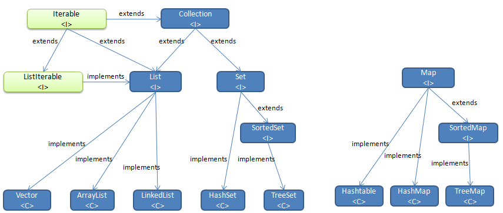

## 集合框架：
### 1. 集合的由来
#####  数组长度是固定,当添加的元素超过了数组的长度时需要对数组重新定义,太麻烦,JAVA内部给我们提供了集合类,能存储任意对象,长度是可以改变的,随着元素的增加而增加,随着元素的减少而减少。
##### 数组和集合的区别：
- 数组可以存储基本数据类型（`数据的值`）和引用数据类型（`地址值`），集合只能存储引用数据类型（存储基本数据类型是因为`自动装箱`）；
- 数组长度是固定的,不能自动增长，集合可变。

### 2. 集合的继承体系图

				

### 3. 单列集合
##### 顶层接口为Collection,`List`接接口实现类存取有序,有索引,可以重复
- `ArrayList`底层是数组实现的,线程不安全,查找和修改快,增和删比较慢；
- `LinkedList`底层是链表实现的,线程不安全,增和删比较快,查找和修改比较慢；
- `Vector` 底层是数组实现的,线程安全的,无论增删改查都慢。

##### `Set`接接口实现类存取无序,无索引,不可以重复
- `HashSet`底层是哈希算法，可以保证元素唯一；
- `LinkedHashSet`底层是链表实现,可以保证元素唯一,存取有序；
- `TreeSet`底层是二叉树算法实现，可以用来排序。

### 4. 双列集合
##### 顶层接口为Map,以key=value的形式存储数据
- HashMap，底层是哈希算法,针对键；
- LinkedHashMap，底层是哈希算法,针对键
- TreeMap, 底层是二叉树算法,针对键

### 5. 集合的遍历方式
```java
 List<String> list = new ArrayList<String>();
	list.add("a");
	list.add("b");
	list.add("c");
	list.add("d");

//迭代器

Iterator it = list.iterator(); 
    while(it.hasNext()) {  
      System.out.println(it.next());
    }

// for循环和增强for

for(int i = 0;i < list.size(); i++) {
       	 System.out.println(list.get(i));
     } 

    for(String str:list) {
      System.out.println(str);
     }

// map集合遍历

 Map<String, Integer> map = new HashMap<>();
 Set<String> keySet = map.keySet();  //获取所有键的集合
 Iterator<String> it = keySet.iterator();
  while(it.hasNext()) {
     System.out.println(it.next() + "=" + map.get(key));
  }

 Set<Map.Entry<String, Integer>> entrySet = map.entrySet();//获取键值对对象的集合
 Iterator<Map.Entry<String, Integer>>it = entrySet.iterator();
  while(it.hasNext()) {
   Map.Entry<String, Integer>en = it.next();
   System.out.println(en.getKey()+ "=" + en.getValue());
 }
```
`注意`：不可以在遍历的情况下使用集合的方法操作集合中的元素，会发生并发修改异常；如果需要操作集合元素，只能使用迭代器的特有方法操作，如remove();for循环可以通过索引，伤处元素，增强for无索引则不可以删除元素。

### 6. 集合的特殊用法
- `LinkedList`具有`addFirst()、addLast() getFirst()、getLast()、removeFirst()、removeLast()`等方法；
- `TreeSet`用来排序, 可以通过比较器指定一个顺序, 对象存入之后会按照指定的顺序排列,实体类需要实现`Comparable`接口，重写`compareTo（）`，也可以直接在`TreeSet`构造方法中传入一个指定顺序的比较器；

```java
 TreeSet<String>ts = new TreeSet<>(new Comparator<String>() {
  @Override
   public int compare(String s1, String s2) {
   int num = s1.compareTo(s2);
   return num == 0 ? 1 : num;
     }
 });
```